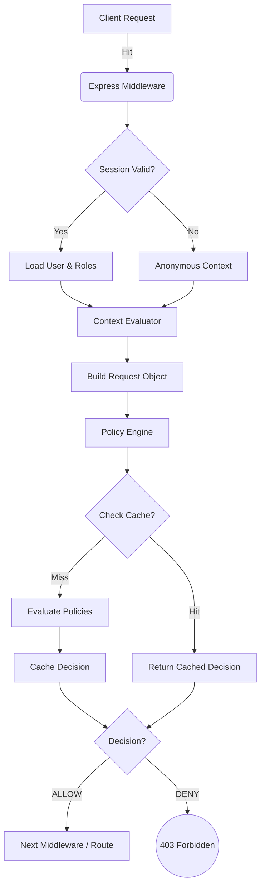

# Zero Trust Framework v2 (ztfv2)

A lightweight, redis-backed Zero Trust security framework for Node.js applications.

[]()
[](https://www.typescriptlang.org/)

## Overview

**ztfv2** is designed to enforce strict identity verification and least-privilege access for every request in your application. It integrates seamlessly with **Express** (and is extensible for other frameworks) and can use Redis for high-performance session management and decision caching.

### Key Features

- **Policy Engine**: Define dynamic, code-based access policies.
- **Context Awareness**: Make decisions based on request context (IP address, time of day, user agent, etc.).
- **High Performance**: Caches policy decisions and sessions in Redis to minimize latency.
- **Easy Integration**: Drop-in middleware for Express.js.

---

## Architecture & Flow

The framework intercepts every request to evaluate whether it should be allowed based on the current context and active policies.



---

## 📦 Installation

```bash
npm install ztfv2
# or
yarn add ztfv2
```

> **Note:** You must have a Redis instance running. By default, the framework connects to `localhost:6379`.

---

## 🛠️ Usage

### 1. Initialize Components

Set up the core components in your application entry point (e.g., `app.ts` or `index.ts`).

```typescript
import express from 'express';
import { 
  RedisClient, 
  PolicyEngine, 
  SessionManager, 
  zeroTrustGuard, 
  Decision 
} from 'ztfv2';

const app = express();

// Initialize Singletons
const redisClient = RedisClient.getInstance();
const sessionManager = new SessionManager(redisClient);
const policyEngine = new PolicyEngine(redisClient);
```

### 2. Define Policies

Policies are functions that take a request object and return a `Decision`.

```typescript
// Example: Only allow admins to access '/admin' resources
policyEngine.addPolicy({
  id: 'admin-only',
  evaluate: (req) => {
    if (req.resource.startsWith('/admin')) {
        if (req.context.roles?.includes('admin')) {
            return Decision.ALLOW;
        }
        return Decision.DENY;
    }
    return Decision.DENY; // Default deny for admin routes
  }
});

// Example: Allow public access to login
policyEngine.addPolicy({
    id: 'public-login',
    evaluate: (req) => {
        if (req.resource === '/login' && req.action === 'post') {
            return Decision.ALLOW;
        }
        return Decision.DENY;
    }
});
```

### 3. Apply Middleware

Mount the `zeroTrustGuard` middleware heavily.

```typescript
app.use(zeroTrustGuard({
  policyEngine,
  sessionManager
}));

// Your routes
app.get('/admin/dashboard', (req, res) => {
  res.send('Welcome Admin!');
});

app.post('/login', async (req, res) => {
    // Authenticate user logic...
    // Create session
    const session = await sessionManager.createSession('user-123', ['admin']);
    res.json({ token: session.sessionId });
});

app.listen(3000, () => {
  console.log('Server running on port 3000');
});
```

---

## Core Concepts

### Context
The `ContextEvaluator` builds a context object for every request, containing:
- `ip`: Request IP address.
- `timestamp`: Time of the request.
- `userAgent`: Client's user agent string.
- `userId`: (If authenticated) The user's ID.
- `roles`: (If authenticated) The user's roles.

### Policy Engine
The engine evaluates a list of policies.
- **Default Strategy**: If *any* policy returns `DENY`, the request is denied immediately. If *any* policy returns `ALLOW` (and none `DENY`), the request is allowed.
- **Caching**: Decisions are cached in Redis for 60 seconds (configurable) to reduce computational overhead.

---

## Testing

To run the internal unit tests:

```bash
npm test
```

## Contributing

Contributions are welcome! Please open an issue or submit a pull request.
